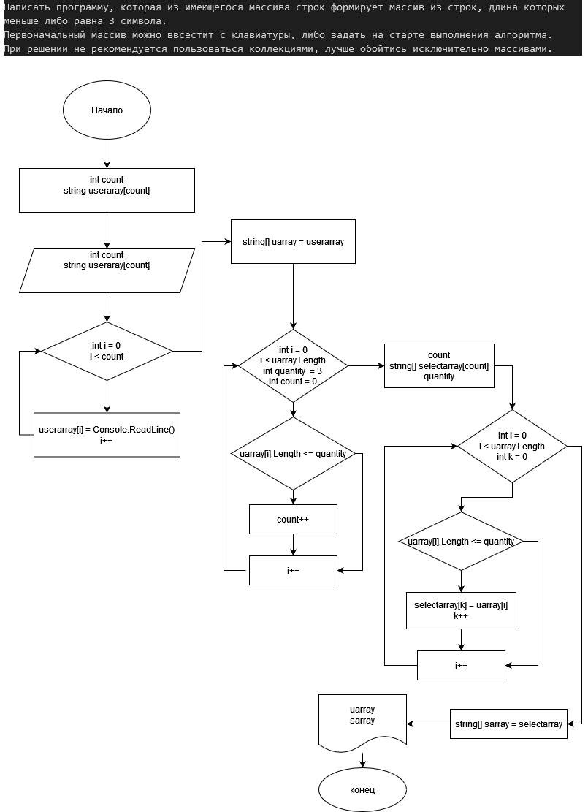

## Контрольная работа 1 четверть:

***Итоговая проверочная работа:

1. Создать репозиторий на GitHub.

2. Нарисовать блок схему алгоритма (можно обойтись блок-схемой основной содержательной части, если Вы выделяете ее в отдельный метод).

3. Снабдить репозиторий оформленным текстовым описанием решения (файл README.md).

4. Неписать программу решающую поставленную задачу.

5. Использовать контроль версий в работе над этим небольшим проектом (не должно быть так, что все залито одним коммитом, как минимум - этапы 2, 3 и 4 должны быть расположены в коммитах).

### Задача: 
Написать программу, которая из имеющегося массива строк формирует массив из строк, длина которых меньше либо равна 3 символа.
Первоначальный массив можно ввeсти с клавиатуры, либо задать на старте выполнения алгоритма.
При решении не рекомендуется пользоваться коллекциями, лучше обойтись исключительно массивами.

## Решение:
***Описание алгоритма:***
1. Создать ввод строкового массива от пользователя (пользователь задает количество элементов массива и создает сами элементы)
2. Создать метод выбора элементов массива по заданным параметрам (длина элемента не должна быть более 3)
3. Вывод массива с выбранными элементами.
    

    